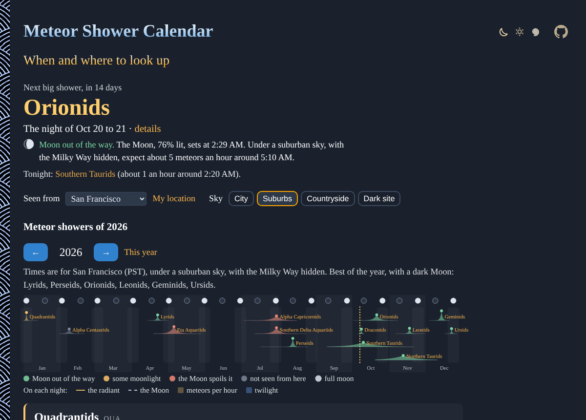

# Meteor-Shower-Calendar

When are the Perseids? The Geminids, the Quadrantids and the rest of the year's meteor showers, right in your browser: their peaks, the Moon's interference, the best time to watch and where to look, from your city, for any year from 1900 to 2100. No sign-up and no libraries.

- [See the meteor showers](https://evoluteur.github.io/meteor-shower-calendar/)
- Any year: add `?year=2032` to the address, or use the arrows (or the arrow keys)
- Any city: pick one in "Seen from", or use your location

## What it does

- **The next big shower**: its name, the night of its peak and how many days away, the Moon that night, and how many meteors an hour to expect. And **tonight**: the showers active now, with their rates.
- **Sky**: city, suburbs, countryside or a dark site. The rates change with how dark the sky is.
- **The year**: the showers on a timeline, each with the shape of its activity, its peak colored by the Moon (out of the way, some moonlight, spoiled, or not seen from your place), with the full and new moons on top.
- **A card for each shower**: the night of the peak and the days it is active, the Moon (how full, when it rises or sets), the ZHR, the meteors per hour from your sky, the best time, and the speed of the meteors.
- **The night of the peak**: a chart of the night, from dusk to dawn, with the twilight, the height of the radiant and of the Moon, and the meteors per hour; and a compass of the sky with the radiant and the Moon at the best time.
- **Where to look**: the radiant's constellation and direction, and the shower's story and parent comet.

Times are shown in the time zone of the chosen city.

## The showers

Quadrantids, Alpha Centaurids, Lyrids, Eta Aquariids, Southern Delta Aquariids, Alpha Capricornids, Perseids, Draconids, Southern Taurids, Orionids, Northern Taurids, Leonids, Geminids and Ursids: the major showers of the [International Meteor Organization](https://www.imo.net/)'s calendar, with their peak solar longitude, ZHR, radiant, speed and population index ([js/showers.js](https://github.com/evoluteur/meteor-shower-calendar/blob/main/js/showers.js)).

## How it is computed

Everything is computed in the browser, in [js/astro.js](https://github.com/evoluteur/meteor-shower-calendar/blob/main/js/astro.js) and [js/meteors.js](https://github.com/evoluteur/meteor-shower-calendar/blob/main/js/meteors.js), with the methods of Jean Meeus's _Astronomical Algorithms_ (the same as [Eclipse Calendar](https://github.com/evoluteur/eclipse-calendar)).

- **The peak**: a shower peaks when the Earth reaches the same point of its orbit, the same solar longitude, every year. The date comes from the position of the Sun (chapter 25), solved for that longitude.
- **The activity** falls off exponentially either side of the peak, at a rate for each shower.
- **The night**: every 10 minutes from dusk to dawn, the height of the Sun (for the twilight), of the Moon (chapter 47) and of the radiant, seen from the city.
- **The meteors per hour**: ZHR × sin(height of the radiant) × r^(limiting magnitude − 6.5), where r is the shower's population index and the limiting magnitude is that of the sky you picked, lowered by moonlight (more for a fuller and higher Moon, a rule of thumb).
- **The Moon's interference**: the best rate of the night with the Moon, compared to the same night without it.

Real showers vary from year to year, and some, like the Draconids or the Leonids, can surprise with an outburst: the rates are a guide, not a promise.

## How it is built

Plain HTML, CSS and JavaScript, with no dependencies and no build step. Just open `index.html`. It is also a small installable web app that works offline.

- The three color themes (dark, light and blue) are shared with my other projects, copied from [omg-themes](https://github.com/evoluteur/omg-themes) (`npm run sync:themes` refreshes them).

Meteor-Shower-Calendar is open source at [GitHub](https://github.com/evoluteur/meteor-shower-calendar) with MIT license.

Had fun browsing the app? [Buy me a coffee by becoming a sponsor](https://github.com/sponsors/evoluteur).

You may also be interested in [Eclipse-Calendar](https://github.com/evoluteur/eclipse-calendar) ([demo](https://evoluteur.github.io/eclipse-calendar/)), [Moon-Phase-Calendar](https://github.com/evoluteur/moon-phase-calendar) ([demo](https://evoluteur.github.io/moon-phase-calendar/)) and [Mercury-Retrograde](https://github.com/evoluteur/mercury-retrograde) ([demo](https://evoluteur.github.io/mercury-retrograde/)). For more mystic arts as small web apps, see [Esoterica](https://evoluteur.github.io/esoterica.html).

Copyright (c) 2026 [Olivier Giulieri](https://evoluteur.github.io/).
